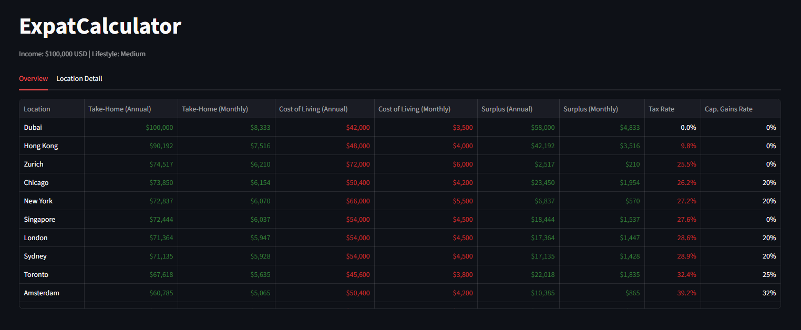
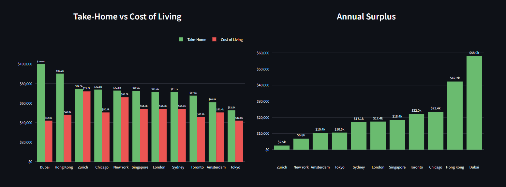
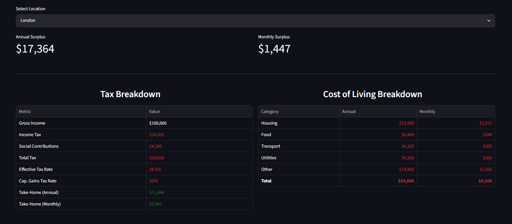

# ExpatCalculator

A Python tool to compare take-home pay and cost of living across different international locations.

**🌐 Live app: [expatcalculator.streamlit.app](https://expatcalculator.streamlit.app)** — no installation required.

## Overview

This project helps expats and remote workers calculate and compare:
- **Income tax** (federal, state, local, and social contributions)
- **Effective tax rates** across different jurisdictions  
- **Take-home pay** after all taxes
- **Cost of living** estimates by lifestyle (low, medium, high), or your own custom per-category figures
- **Capital gains tax rates** for investment income
- **Location comparisons** to find the best financial fit
- **Investment projections** — long-term wealth growth from investing your surplus, with expected salary growth and cost-of-living inflation, net of each location's capital gains tax
- **Salary normalisation (optional)** — scale income per location to reflect how pay for the same role varies by city and industry

## Supported Locations

- **London, UK** - Complex progressive tax system with National Insurance
- **New York, USA** - Federal, state, and city taxes combined
- **Hong Kong** - Favorable tax environment with no capital gains tax
- **Chicago, USA** - Flat state tax with federal income tax
- **Dubai, UAE** - No income tax jurisdiction
- **Zurich, Switzerland** - Low federal tax with canton-based variations
- **Tokyo, Japan** - Progressive tax system with local inhabitant tax
- **Singapore** - Low progressive tax with CPF social contributions, no capital gains tax
- **Toronto, Canada** - Federal and Ontario provincial progressive tax
- **Sydney, Australia** - Federal progressive tax with Medicare Levy, no separate state income tax
- **Amsterdam, Netherlands** - Box 1 system with national insurance embedded in tax brackets
- **Cape Town, South Africa** - Progressive tax with primary rebate system
- **Bern, Switzerland** - Federal + Bern canton tax (slightly higher than Zurich)
- **Bangkok, Thailand** - Low progressive tax, very affordable cost of living

## Supported Currencies
- **USD**
- **GBP**

## Project Structure

```
ExpatCalculator/
├── app.py                   # Streamlit web UI
├── src/
│   ├── __init__.py          # Public API re-exports
│   ├── models.py            # Result dataclasses
│   ├── currency.py          # Live exchange rates (open.er-api.com)
│   ├── calculator.py        # TaxCalculator + investment projections
│   ├── formatters.py        # Terminal output formatting
│   └── script.py            # CLI entry point (python -m src.script)
├── data/
│   ├── tax_rates.json       # Tax rate data by jurisdiction
│   ├── cost_of_living.json  # Cost of living estimates
│   └── salary_indices.json  # Relative salary levels by location and industry
└── README.md                # This file
```

## Data Files

### `tax_rates.json`
Contains income tax brackets, capital gains rates, and social contributions for each location:
- Progressive income tax brackets (where applicable)
- Flat tax rates
- National Insurance / Social Security rates
- Capital gains tax rates
- Special tax considerations

### `cost_of_living.json`
Estimates annual and monthly costs of living by location and lifestyle level:
- **Low**: Modest but comfortable lifestyle (budget housing, local transport)
- **Medium**: Professional standard of living (private flat, entertainment)
- **High**: Luxury lifestyle (premium areas, fine dining, exclusive venues)

Breakdown includes: housing, food, transport, utilities, and other expenses

### `salary_indices.json`
Approximate relative gross salary levels for the same role and seniority, indexed to New York = 1.00 within each industry (general, technology, finance, healthcare, engineering, education, hospitality). Used by the optional **salary normalisation** mode: income is scaled by `index(location) / index(base_location)`, so only ratios between cities within an industry matter.

## Usage

### Use the Web UI (Streamlit)

The app is hosted online and always available at **[expatcalculator.streamlit.app](https://expatcalculator.streamlit.app)** — just open the link, no installation needed.

To run it locally instead (for development), install the dependencies and launch it:

```bash
pip install -r requirements.txt
streamlit run app.py
```

This serves the same app at `http://localhost:8501`.

The web UI provides:
- **Overview tab** — sortable comparison table for all locations + bar charts
- **Location Detail tab** — full tax and cost-of-living breakdown for a selected city, with the option to override the cost-of-living figures with your own (custom values apply across the whole app for that city)
- **Investment tab** — project wealth growth from investing a share of your monthly surplus (choose risk profile, time horizon, expected annual salary growth, and cost-of-living inflation), with capital gains tax applied on sale and a cross-location comparison of final wealth

Adjust income, currency, and lifestyle in the sidebar; the UI updates instantly. Optionally enable **Salary Normalisation** to scale the income for each location by typical pay for your industry — the income you enter is treated as your salary in the chosen base location, and a Gross Income column appears in the overview table.

<br>


<br>


<br>


<br>

---

### Run From Terminal

Input desired values to the following variables in `src/script.py`

```python
ANNUAL_INCOME = 120_000
ANNUAL_INCOME_CURRENCY = "GBP"
LOCATION = "london"
LIFESTYLE = "medium"
```

Then run the script and view the output in the terminal:

```bash
python -m src.script
```

### Run in Python

#### Basic Usage

```python
from src import TaxCalculator, print_tax_result

# Initialize calculator
calc = TaxCalculator()

# Calculate tax for London with £100,000 income
result = calc.calculate_income_tax(100000, "london")
col = calc.get_cost_of_living("london", "medium")

# Display results
print_tax_result(result, col)
```

#### Get Available Locations

```python
locations = calc.get_available_locations()
print(locations)
# Output: ['london', 'new_york', 'hong_kong', 'chicago', 'dubai', 'zurich', 'tokyo', 'singapore', 'toronto', 'sydney', 'amsterdam', 'cape_town', 'bern', 'bangkok']
```

#### Compare All Locations

```python
comparison = calc.compare_locations(annual_income=100000, lifestyle="medium")
for location, data in comparison.items():
    print(f"{location}: ${data['tax_result'].take_home_pay:,.0f}")
```

#### Get Capital Gains Tax Rate

```python
rate, notes = calc.get_capital_gains_tax_rate("london")
print(f"Capital gains tax: {rate*100}%")
```

#### Get Cost of Living Breakdown

```python
col = calc.get_cost_of_living("hong_kong", "high")
print(f"Annual: ${col.annual_total:,.0f}")
print(f"Housing: ${col.housing:,.0f}")
print(f"Food: ${col.food:,.0f}")
```

## Key Results from Example Run

For a $100,000 annual income with medium lifestyle:

| Location | Take-Home (USD) | Cost of Living (USD) | Surplus (USD) |
|----------|-----------------|----------------------|---------------|
| Dubai | $100,000 | $42,000 | $58,000 |
| Hong Kong | $90,192 | $48,000 | $42,192 |
| Zurich | $74,517 | $72,000 | $2,517 |
| Chicago | $73,850 | $50,400 | $23,450 |
| New York | $72,837 | $66,000 | $6,837 |
| Singapore | $72,444 | $54,000 | $18,444 |
| London | $71,364 | $54,000 | $17,364 |
| Sydney | $71,135 | $54,000 | $17,135 |
| Toronto | $67,618 | $45,600 | $22,018 |
| Amsterdam | $60,785 | $50,400 | $10,385 |
| Tokyo | $52,540 | $42,000 | $10,540 |

## Tax System Details

### United Kingdom (London)
- Progressive income tax: 0% → 20% → 40% → 45%
- National Insurance: 8% (basic) → 2% (higher earners)
- Capital gains tax: 20% (£3,000 annual allowance)
- Dividend tax: 11.25% (£500 annual allowance)

### United States (New York & Chicago)
- Federal progressive tax: 10% → 37% (7 brackets)
- State tax: NY varies by bracket (up to 10.9%), IL flat 4.95%
- City tax: NYC 3.876%, Chicago 3.8%
- Long-term capital gains: 15% (federal)
- Social Security/Medicare: 7.65%

### Hong Kong
- Progressive tax: 2% → 6% → 10% → 14% → 17%
- **No capital gains tax**
- **No dividends tax** (foreign-sourced income typically exempt)
- Very favorable for investment income

### United Arab Emirates (Dubai)
- **No income tax**
- **No capital gains tax**
- **No corporate tax** (except oil companies)
- One of the world's most tax-friendly jurisdictions

### Switzerland (Zurich)
- Federal progressive tax: 1% → 13.2% (high progressive rate)
- Canton/Local taxes: ~22% typical for Zurich combined
- **No capital gains tax** for long-term holdings
- Employee social contributions: ~8.7%

### Japan (Tokyo)
- Progressive tax: 5% → 45% (7 brackets)
- Local inhabitant tax: ~5%
- Social insurance: ~19.7% (employee + employer)
- Capital gains: 20% for long-term holdings

### Singapore
- Progressive tax: 0% → 22% (11 brackets, very low at low incomes)
- CPF employee contribution: 20% (capped at SGD 102,000/year)
- **No capital gains tax**
- **No dividend tax** for residents

### Canada (Toronto / Ontario)
- Federal progressive tax: 15% → 33% (5 brackets)
- Ontario provincial tax: 5.05% → 13.16% (5 brackets)
- CPP + EI social contributions: heavily capped (~CAD 5,000/year max)
- Capital gains: 50% inclusion rate (~25% effective rate approximation)

### Australia (Sydney)
- Federal progressive tax: 0% → 45% (5 brackets, post-Stage 3 cuts 2024-25)
- Medicare Levy: 2% flat
- Employer superannuation: 11.5% (paid on top of salary, does not reduce take-home)
- Capital gains: 50% discount for assets held >12 months (~20% effective rate)

### Netherlands (Amsterdam)
- Box 1 (employment income): 36.97% → 49.5% (2 brackets)
- Lower rate includes national insurance contributions (AOW/ANW/WLZ)
- General and employment tax credits reduce actual liability (not modelled)
- Box 3 (investment assets): deemed return system, ~32% effective rate

### South Africa (Cape Town)
- Progressive income tax: 18% → 26% → 31% → 36% → 39% → 41% → 45% (7 brackets)
- Primary rebate of R17,235 reduces actual tax liability (not modelled — rates shown slightly high)
- No modelled social contributions (UIF 1% capped at ~R17,712/year, negligible for high earners)
- Capital gains: 40% inclusion rate at marginal rate (~18% effective rate)

### Switzerland (Bern)
- Same federal progressive tax as Zurich (1% → 13.2%)
- Bern canton/commune combined rate ~23.5% (slightly higher than Zurich's ~22%)
- **No capital gains tax** for long-term holdings
- Employee social contributions ~8.7% (not modelled)

### Thailand (Bangkok)
- Progressive income tax: 0% → 5% → 10% → 15% → 20% → 25% → 30% → 35% (8 brackets)
- Standard deductions (personal allowance, employment expense deduction) not modelled — rates shown slightly high
- Social Security Fund 5% capped at B9,000/year — negligible for high earners, not modelled
- **No capital gains tax** on Thai Stock Exchange; foreign-sourced gains generally 0% for non-residents

## Class Reference

All public names are re-exported from the `src` package (`from src import TaxCalculator, ...`); the modules below are where they live.

### TaxCalculator (`src/calculator.py`)

**Methods:**
- `calculate_income_tax(annual_income, location)` → TaxResult
- `calculate_tax_on_brackets(income, brackets)` → (total_tax, effective_rate)
- `get_capital_gains_tax_rate(location)` → (rate, notes)
- `get_cost_of_living(location, lifestyle, custom_values=None)` → CostOfLivingBreakdown (custom_values: partial `{category: annual_usd}` override)
- `compare_locations(annual_income, input_currency, lifestyle, normalise_salaries=False, base_location=None, industry="general", custom_col=None)` → dict of results (custom_col: `{location: {category: annual_usd}}`)
- `get_salary_index(location, industry)` → float (New York = 1.00)
- `get_available_industries()` → list
- `get_available_locations()` → list

### TaxResult (`src/models.py`)
```python
@dataclass
class TaxResult:
    gross_income: float
    location: str
    currency: str
    exchange_rate_usd: float
    total_tax: float
    income_tax: float
    social_contributions: float
    effective_tax_rate: float
    take_home_pay: float
```

### CostOfLivingBreakdown (`src/models.py`)
```python
@dataclass
class CostOfLivingBreakdown:
    location: str
    lifestyle_level: str
    annual_total: float
    monthly_total: float
    housing: float
    food: float
    transport: float
    utilities: float
    other: float
```

### project_investment (`src/calculator.py`)

Module-level function projecting wealth growth from investing a share of monthly surplus. Each year, take-home pay grows by `salary_growth` and cost of living by `col_inflation`, and the surplus is recomputed monthly. The invested share compounds monthly at the chosen annual return; the remainder is held as cash at 0% growth. Capital gains tax is applied once, on sale at the end of the horizon. With both growth rates at 0 it reduces to a constant-surplus projection.

```python
from src import project_investment

proj = project_investment(
    monthly_take_home=5000,    # in your input currency
    monthly_cost=3000,         # cost of living per month
    invest_fraction=0.5,       # 50% of surplus invested
    annual_return=0.07,        # 7% expected annual return
    years=20,
    capital_gains_rate=0.20,   # from get_capital_gains_tax_rate()
    salary_growth=0.03,        # 3%/yr take-home growth (optional)
    col_inflation=0.02,        # 2%/yr cost-of-living inflation (optional)
)
print(f"Final wealth: {proj.final_wealth:,.0f}")
print(f"CGT paid:     {proj.capital_gains_tax:,.0f}")
```

### InvestmentProjection (`src/models.py`)
```python
@dataclass
class InvestmentProjection:
    years: int
    annual_return: float
    capital_gains_rate: float
    monthly_investment: float
    monthly_cash: float
    total_contributions: float
    portfolio_gross: float
    capital_gains_tax: float
    portfolio_after_tax: float
    cash_total: float
    final_wealth: float
    yearly_wealth: list        # after-tax total wealth if liquidated at end of each year
    yearly_contributed: list   # cumulative surplus put in (invested + cash)
    salary_growth: float = 0.0
    col_inflation: float = 0.0
```

## Data Sources & Notes

- Tax rates based on 2024-2025 information
- Rates may change - verify with official tax authorities before making decisions
- This is informational only - consult with tax professionals for actual tax planning
- Currency exchange rates fetched live at startup via [open.er-api.com](https://open.er-api.com); falls back to hardcoded rates if unreachable

## License

This project is provided as-is for informational purposes.

## Disclaimer

This calculator provides estimates only and should not be relied upon for actual tax planning or financial decisions. Tax laws change frequently and vary based on individual circumstances (residency status, employment type, business structure, etc.). 

**Always consult with qualified tax professionals and accountants in your jurisdiction before making any financial or relocation decisions.**
